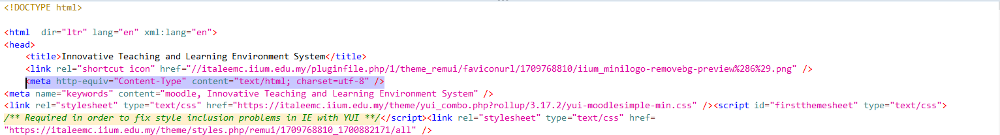

# iTaleem_CaseStudy

## Group Members
1. Wan Hamzah Iyad bin Wan Adlan (2115449) - Leader
2. Muhammad bin Abas (2113201)
3. Muhammad Arif Faisal bin Zahari (2117277)

## Assigned Tasks
1. Muhammad bin Abas
    - Identify, evaluate and prevent of:
      - Hash Disclosure.
      - CSRF. 
      - Secured Cookies.

3. Wan Hamzah Iyad bin Wan Adlan
    - Identify, evaluate and prevent of:
      - CSP
      - JS Library
      - HTTPS implementation (TLS/SSL)

4. Muhammad Arif Faisal bin Zahari (2117277)
    - Identify, evaluate and prevent of:
      - Server OS and Server-Side Scripting
      - Cookie Poisoning
      - Potential XSS
      - Information Disclosure
     
## Table of Contents
1. [Description](#desc)
2. [Observation Results](#obsv)
    1. [Server OS and Server-Side Scripting used (Windows or Linux, PHP or ASP.net or JavaScript, etc)](#serv)
    2. [Hash Disclosure](#hash)
    3. [CSRF](#csrf)
    4. [Secured Cookies](#sec)
    5. [CSP](#csp)
    6. [JS Library](#jsl)
    7. [HTTPS implementation (TLS/SSL)](#https)
    8. [Cookie Poisoning](#coo)
    9. [Potential XSS](#xss)
    10. [Information Disclosure](#inf)

## <a name="desc"/> Case Study Description
We have been assigned the e-learning platform for IIUM, iTaleem located at https://italeemc.iium.edu.my/. The purpose of this case study to identify, evaluate and prevent the security vulnerabilities that are found within the web application. We will be using the OWASP ZAP scanning tool to aid us in the investigation using both the automated and manual scanning feature.  

We will mainly be focusing on automated scan due to the large amount of webpages the site has. <br>


## <a name="obsv"/>Observation Results

### <a name="serv"/>a. Server OS and Server Side-Scripting
#### Identify:
- Server Leaks Version Information via "Server" HTTP Response Header Field
    - CWE ID: 200 - Exposure of Sensitive Information to an Unauthorized Actor
    - WASC ID: 13
    - Risk Level: Low
    - Confidence Level: High
    - The vulnerability is located at <a>https://cas.iium.edu.my:8448/cas/login?service=https%3A%2F%2Fitaleemc.iium.edu.my%2Flogin%2Findex.php%3FauthCAS%3DCAS&gateway=true/</a>
    - Evidence: ```Apache/2.4.6 (CentOS) OpenSSL/1.0.2k-fips mod_nss/1.0.14 NSS/3.28.4 PHP/5.4.16```
 

#### Evaluate:
When a server leaks version information via the "Server" HTTP response header field, it provides attackers with valuable insight into the software stack and version numbers of the server software being used. This information can be exploited by attackers to identify known vulnerabilities associated with specific versions of software, increasing the likelihood of successful attacks.
#### Prevent:
- Disable or Modify Server Header: Configure the web server to disable or modify the "Server" HTTP response header to prevent it from revealing version information. This can typically be done through server configuration settings or by using security modules or plugins.
- Implement Web Application Firewalls (WAFs): Deploy a web application firewall (WAF) to inspect and filter HTTP headers, including the "Server" header. WAFs can be configured to remove or obfuscate sensitive information before it is sent to clients, helping to protect against information leakage.
#### Related: 
- CVE-2015-2080: The exception handling code in Eclipse Jetty before 9.2.9.v20150224 allows remote attackers to obtain sensitive information from process memory via illegal characters in an HTTP header, aka JetLeak.

### <a name="hash"/>b. Hash Disclosure
#### Identify:
- No alert was gained from the automated or manual scan. This vulnerability has a low-risk level, and the weakness ID for CWE is 200, which stands for Exposure of Sensitive Information to an Unauthorized Actor <a>https://www.zaproxy.org/docs/alerts/10097/</a>.

#### Evaluate:
- N.A. for this website. This web application has prevented and concealed their hashed form of information.

#### Prevent:
- N.A. for this website. Otherwise, ensure that the web server or database does not leak hashes used to protect credentials or other resources. There is typically no requirement that password hashes be accessible to the web browser.

### <a name="csrf"/>c. CSRF
#### Identify:
- Absence of Anti-CSRF Tokens
  - CWE ID: 352 - Cross-Site Request Forgery (CSRF)
  - WASC ID: 9
  - Risk Level: Medium
  - Confidence Level: Low
  - The vulnerability is located at <a>https://italeemc.iium.edu.my/</a>
  - Evidence:<br>
    
    No known Anti-CSRF token: ```[anticsrf, CSRFToken, __RequestVerificationToken, csrfmiddlewaretoken, authenticity_token, OWASP_CSRFTOKEN, anoncsrf, csrf_token, _csrf, _csrfSecret, __csrf_magic, CSRF, _token, _csrf_token] was found in the following HTML form: [Form 1: "anchor" "logintoken" "password" "rememberusername" "username" ]```

#### Evaluate:
No Anti-CSRF tokens were found in a HTML submission form.

A cross-site request forgery is an attack that involves forcing a victim to send an HTTP request to a target destination without their knowledge or intent in order to perform an action as the victim. The underlying cause is application functionality using predictable URL/form actions in a repeatable way. The nature of the attack is that CSRF exploits the trust that a web site has for a user. By contrast, cross-site scripting (XSS) exploits the trust that a user has for a web site. Like XSS, CSRF attacks are not necessarily cross-site, but they can be. Cross-site request forgery is also known as CSRF, XSRF, one-click attack, session riding, confused deputy, and sea surf.

CSRF attacks are effective in a number of situations, including:
    * The victim has an active session on the target site.
    * The victim is authenticated via HTTP auth on the target site.
    * The victim is on the same local network as the target site.

CSRF has primarily been used to perform an action against a target site using the victim's privileges, but recent techniques have been discovered to disclose information by gaining access to the response. The risk of information disclosure is dramatically increased when the target site is vulnerable to XSS, because XSS can be used as a platform for CSRF, allowing the attack to operate within the bounds of the same-origin policy.


Reference: <a>https://cwe.mitre.org/data/definitions/352.html</a>

#### Related:
- OWASP_2021_A01: Broken Access Control - Weaknesses in access control that allow unauthorized access to data or functionality.
- WSTG-v42-SESS-05: Testing for Cross Site Request Forgery - This is a comprehensive resource by the OWASP that provides methodologies and guidance for testing the security of web applications.
- OWASP_2017_A06: Security Misconfiguration - The dangers of inadequate security settings across application stacks or servers that could expose them to attack.

#### Prevent:
- Phase: Architecture and Design
    - Use a vetted library or framework that does not allow this weakness to occur or provides constructs that make this weakness easier to avoid. For example, use anti-CSRF packages such as the OWASP CSRFGuard.
    - Generate a unique nonce for each form, place the nonce into the form, and verify the nonce upon receipt of the form. Be sure that the nonce is not predictable (CWE-330) (Note that this can be bypassed using XSS).
    - Identify especially dangerous operations. When the user performs a dangerous operation, send a separate confirmation request to ensure that the user intended to perform that operation (Note that this can be bypassed using XSS).

- Use the ESAPI Session Management control. This control includes a component for CSRF.

- Do not use the GET method for any request that triggers a state change. For example, if you want to delete a user account, instead of using a simple GET request with a delete confirmation link ``` delete_account.php?confirm=yes```, use a POST request with a hidden form field containing a CSRF token. This enforces a more secure interaction where the user submits data through a form, making it harder for attackers to exploit CSRF vulnerabilities.

- Phase: Implementation
    - Ensure that your application is free of cross-site scripting issues, because most CSRF defenses can be bypassed using attacker-controlled script.
    - Check the HTTP Referer header to see if the request originated from an expected page. This could break legitimate functionality, because users or proxies may have disabled sending the Referer for privacy reasons.

Reference: <a>https://cheatsheetseries.owasp.org/cheatsheets/Cross-Site_Request_Forgery_Prevention_Cheat_Sheet.html</a>

### <a name="sec"/>d. Secured Cookies
#### Identify:
- Cookie No HttpOnly Flag
    - CWE ID: 1004 - Sensitive Cookie Without 'HttpOnly' Flag
    - WASC ID: 13
    - Risk Level: Low
    - Confidence Level: Medium
    - The vulnerability is located at <a>https://italeemc.iium.edu.my/</a>
    - Evidence:<br>
          
          
#### Evaluate:
The product uses a cookie to store sensitive information, but the cookie is not marked with the HttpOnly flag.

The HttpOnly flag directs compatible browsers to prevent client-side script from accessing cookies. Including the HttpOnly flag in the Set-Cookie HTTP response header helps mitigate the risk associated with Cross-Site Scripting (XSS) where an attacker's script code might attempt to read the contents of a cookie and exfiltrate information obtained. When set, browsers that support the flag will not reveal the contents of the cookie to a third party via client-side script executed via XSS.

A cookie has been set without the HttpOnly flag, which means that the cookie can be accessed by JavaScript. If a malicious script can be run on this page then the cookie will be accessible and can be transmitted to another site. If this is a session cookie then session hijacking may be possible.

Reference: <a>https://cwe.mitre.org/data/definitions/1004.html</a>

#### Related:
- OWASP_2021_A01: Broken Access Control - Weaknesses in access control that allow unauthorized access to data or functionality.
- WSTG-v42-SESS-05: Testing for Cross Site Request Forgery - This is a comprehensive resource by the OWASP that provides methodologies and guidance for testing the security of web applications.
- OWASP_2017_A06: Security Misconfiguration - The dangers of inadequate security settings across application stacks or servers that could expose them to attack.

#### Prevent:
Ensure that the HttpOnly flag is set for all cookies. While this mitigation is effective for protecting cookies from a browser's own scripting engine, third-party components or plugins may have their own engines that allow access to cookies. Attackers might also be able to use XMLHTTPResponse to read the headers directly and obtain the cookie.

### <a name="csp"/>e. Content Security Policy (CSP)
#### Identify:
- CSP Header Not Set
  - CWE ID: 693 - Protection Mechanism Failure
  - Risk Level: Medium
  - Confidence Level: High
  - The vulnerability is located at <a>https://italeemc.iium.edu.my/</a>
  - Evidence:<br>
    
#### Evaluate:
Content Security Policy (CSP) is an added layer of security that helps to detect and mitigate certain types of attacks, including Cross Site Scripting (XSS) and data injection attacks. These attacks are used for everything from data theft to site defacement or distribution of malware. CSP provides a set of standard HTTP headers that allow website owners to declare approved sources of content that browsers should be allowed to load on that page — covered types are JavaScript, CSS, HTML frames, fonts, images and embeddable objects such as Java applets, ActiveX, audio and video files.

In this case, the meta tag in the code for this page does not include a Content Security Policy in the ```meta``` tag. Adding a CSP can significantly enhance the site’s security by restricting resource loading to trusted sources and reducing the risk of XSS attacks. 

#### Related:
- OWASP_2021_A05: Security Misconfiguration - the risk and prevalence of security weaknesses caused by incorrect security settings in applications and servers.
- OWASP_2017_A06: Security Misconfiguration - the dangers of inadequate security settings across application stacks or servers that could expose them to attack.

#### Prevent:
Ensure that your web server, application server, load balancer, etc. is configured to set the Content-Security-Policy header. For example:<br>
```<meta http-equiv="Content-Security-Policy" content="default-src 'self'; img-src 'self' https://*.iium.edu.my; script-src 'self' https://italeemc.iium.edu.my; style-src 'self' https://italeemc.iium.edu.my;">```

### <a name="jsl"/>f. JS Library
#### Identify:
- Vulnerable JS Library
  - CWE ID: 829 - Inclusion of Functionality from Untrusted Control Sphere
  - Risk Level: Medium
  - Confidence Level: Medium
  - The vulnerability is located at https://italeemc.iium.edu.my/lib/requirejs.php/1709768810/core/first.js
  - Evidence: ```t.data("selectpicker",o=new p(this,r))}"string"==typeof s&&(i=o[s]instanceof Function?o[s].apply(o,n):o.options[s])}});return void 0!==i?i:o}p.VERSION="1.12.4"```
#### Evaluate:

A JavaScript library threat in web security refers to the vulnerabilities that can arise from using third-party JavaScript libraries in web applications.  These libraries, while essential for developing interactive and efficient websites, can introduce various security risks if not properly managed or updated. Common threats such as Cross-Site Scripting (XSS) and SQL injections will take advantage of this exposure.

In this case, the version ```1.12.4``` of the ```bootstrap-select``` library has a security issue. It's vulnerable to Cross-Site Scripting (XSS) because it doesn't properly handle special characters in the titles of dropdown options. This may allow attackers to execute unwanted JavaScript code in a victim's browser.

Related:
- CVE-2019-20921: bootstrap-select before 1.13.6 allows Cross-Site Scripting (XSS). It does not escape title values in OPTION elements. This may allow attackers to execute arbitrary JavaScript in a victim's browser.
- OWASP_2017_A09: Using Components with Known Vulnerabilities - the dangers of using software components that are out-of-date or have publicly disclosed vulnerabilities.
- OWASP_2021_A06: Vulnerable and Outdated Components - using software components that have known vulnerabilities due to being outdated or unmaintained.

#### Prevent:
- Upgrade Components: Upgrading to the latest version of bootstrap-select will usually fix the vulnerabilites of past versions
- Implement Content Security Policies (CSP): CSPs can prevent unauthorisde scripts from running on your website.

#### References:
- https://nvd.nist.gov/vuln/detail/CVE-2019-20921
- https://owasp.org/www-project-top-ten/2017/A9_2017-Using_Components_with_Known_Vulnerabilities
- https://owasp.org/Top10/A06_2021-Vulnerable_and_Outdated_Components/

### <a name="https"/>g. HTTPS Implementation
#### Identify:
- No vulnerabilities has been found with the HTTPS implementation for this website after running the automated and manual scanning tool. 

#### Evaluate:
The evaluation of the HTTPS implementation on the website reveals a robust security posture. Both automated and manual scans detected no vulnerabilities, indicating that developers have effectively secured communication channels with SSL/TLS encryption. Moreover, manual inspection confirms compliance with HTTPS standards, ensuring encrypted and authenticated data transmission.

Other than encryption, HTTPS implementation should also include additional security headers like CSP, X-Content-Type-Options, and X-Frame-Options, alongside HTTP Strict Transport Security (HSTS) headers, to further enhance security. 
#### Prevent:
N/A for this website. However, if an alert were to be found, ensure that your web server, application server, load balancer, etc. is configured to enforce Strict-Transport-Security.

### <a name="coo"/>h. Cookie Poisoning
#### Identify:
- Cookie with SameSite Attribute None
  - CWE ID: 1275 - Sensitive Cookie with Improper SameSite Attribute
  - Risk Level: Low
  - Confidence Level: Medium
  - The vulnerability is located at http://italeemc.iium.edu.my/
  - Evidence: ```set-cookie: MoodleSession=9djgupuktfu2rbum7obbkkf939; path=/; secure; SameSite=None```


#### Evaluate:

When the SameSite attribute is set to None, a website can create a cross-domain POST HTTP request to another website, and the browser automatically includes cookies in this request.
This behavior can lead to Cross-Site Request Forgery (CSRF) attacks if there are no additional protections (such as Anti-CSRF tokens) in place.

#### Prevent:
Ensure all cookies have the SameSite attribute set, specifying either "Strict" to restrict cookies to same-site requests only, or "Lax" to permit cookies to be sent with cross-site requests initiated by safe HTTP methods like GET.

#### Related: 
- CVE-2022-24045: A vulnerability exists in Desigo DXR2, Desigo PXC3, Desigo PXC4, and Desigo PXC5 versions prior to specified releases. After login, session cookies are set without security attributes (such as “Secure”, “HttpOnly”, or “SameSite”) via client-side JavaScript. Accessing the application over unencrypted HTTP exposes session cookies, risking interception of sensitive data by network sniffing.

#### References: 
- https://www.cve.org/CVERecord?id=CVE-2022-24045
- https://cwe.mitre.org/data/definitions/1275.html
  
### <a name="xss"/>i. Potential XSS
#### Identify:
- User Controllable HTML Element Attribute
  - CWE ID: 20 - Improper Input Validation
  - Risk Level: Informational
  - Confidence Level: Low
  - The vulnerability is located at https://italeemc.iium.edu.my/?lang=en

#### Evaluate: 

The "lang" attribute in HTML is typically used to specify the language of the content within an element. It's commonly used within the <html> tag to define the language of the entire document, but it can also be used within specific elements to indicate the language of a particular section of content.

However, if the value of the "lang" attribute is directly controlled by a user or comes from an untrusted source without proper validation or encoding, it can lead to Cross-Site Scripting (XSS) vulnerabilities. An attacker could input a value containing malicious JavaScript code into a form field or URL parameter that is then reflected in the "lang" attribute of an HTML element. 

For example:
```<a lang="javascript:alert('XSS')">Click me</a>```

#### Prevent:

- Validate Input: Ensure that user input is properly validated to prevent the injection of malicious code. Reject any input that does not conform to expected values.
- Encode Output: Encode user-controlled data before outputting it into HTML attributes. This ensures that any special characters are properly sanitised and prevents them from being interpreted as part of a script.
#### Related: 
- CVE-2022-25784: Cross-site Scripting (XSS) vulnerability in Web GUI of SiteManager allows logged-in user to inject scripting. This issue affects: Secomea SiteManager all versions prior to 9.7.
#### References:
- https://cwe.mitre.org/data/definitions/20.html
  
### <a name="inf"/>j. Information Disclosure
#### Identify:
1. Timestamp Disclosure - Unix <br>
    - CWE ID: 200 - Exposure of Sensitive Information to an Unauthorized Actor
    - Risk level: Low
    - Confidence level: Low
    - The vulnerability is located at https://italeemc.iium.edu.my/
    - ```1709768810```, which evaluates to: ```2024-03-07 07:46:50``` <br><br>
      
#### Evaluate:

The vulnerability of timestamp disclosure in Unix occurs when an application or web server inadvertently reveals the timestamp of a request or response. It presents several significant risks that can compromise the security and integrity of the system. One key risk is information leakage, where attackers can gain insights into the system's activity patterns through exposed timestamps. This information may reveal sensitive details about system operations or user activities, providing attackers with valuable reconnaissance for potential exploits or attacks. Additionally, timestamp disclosure can expand the attack surface of the system by providing attackers with additional information to refine and target their attacks more effectively. Attackers can organise timing-based attacks, such as timing attacks or replay attacks that exploit vulnerabilities or compromise system integrity.

#### Related CVE:
- CVE-1999-0524: The remote host responds to an ICMP timestamp request, which allows an attacker to determine the time and date on your host. This information could potentially help attackers defeat time-based authentication schemes.

#### Prevent:
- Modify the Unix server configuration to prevent the disclosure of timestamps by the application or web server. This can typically be achieved by adjusting the server’s logging settings or by disabling the specific feature that is causing the disclosure.
- Keep the Unix server up to date with the latest security patches and updates. This helps to address any known vulnerabilities, including those related to timestamp disclosure.
- Make sure that all code paths take the same amount of time. This means that we should avoid returning early to sensitive parts of the codebase.
  

  
