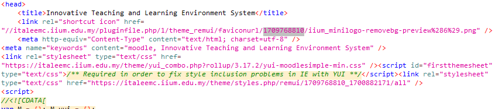

# iTaleem_CaseStudy

## Group Members
1. Wan Hamzah Iyad bin Wan Adlan (2115449) - Leader
2. Muhammad bin Abas
3. Muhammad Arif Faisal bin Zahari (2117277)

## Assigned Tasks
1. Muhammad bin Abas
2. Wan Hamzah Iyad bin Wan Adlan
    - Identify, evaluate and prevent of:
      - CSP
      - JS Library
      - HTTPS implementation (TLS/SSL)

4. Muhammad Arif Faisal bin Zahari (2117277)
    - Identify, evaluate and prevent of:
      - Cookie Poisoning
      - Potential XSS
      - Information Disclosure


## <a name="obsv"/>Observation Results
### <a name="serv"/>j. Information Disclosure

### <a name="serv"/>e. Content Security Policy (CSP)
#### Identify:
- CSP Header Not Set
  - CWE ID: 693 - Protection Mechanism Failure
  - Risk Level: Medium
  - Confidence Level: High
  - The vulnerability is located at <a>https://italeemc.iium.edu.my/</a>
#### Evaluate:
#### Prevent:

### <a name="serv"/>f. JS Library
#### Identify:
- Vulnerable JS Library
  - CWE ID: 829 - Inclusion of Functionality from Untrusted Control Sphere
  - Risk Level: Medium
  - Confidence Level: Medium
  - The vulnerability is located at https://italeemc.iium.edu.my/lib/requirejs.php/1709768810/core/first.js
  - Evidence: ```t.data("selectpicker",o=new p(this,r))}"string"==typeof s&&(i=o[s]instanceof Function?o[s].apply(o,n):o.options[s])}});return void 0!==i?i:o}p.VERSION="1.12.4"```
#### Evaluate:

A JavaScript library threat in web security refers to the vulnerabilities that can arise from using third-party JavaScript libraries in web applications.  These libraries, while essential for developing interactive and efficient websites, can introduce various security risks if not properly managed or updated. Common threats such as Cross-Site Scripting (XSS) and SQL injections will take advantage of this exposure.

In this case, the version 1.12.4 of the library called "bootstrap-select" has a security issue. It's vulnerable to Cross-Site Scripting (XSS) because it doesn't properly handle special characters in the titles of dropdown options. This may allow attackers to execute unwanted JavaScript code in a victim's browser.

Related:
- CVE-2019-20921: bootstrap-select before 1.13.6 allows Cross-Site Scripting (XSS). It does not escape title values in OPTION elements. This may allow attackers to execute arbitrary JavaScript in a victim's browser.
- OWASP_2017_A09: Using Components with Known Vulnerabilities - the dangers of using software components that are out-of-date or have publicly disclosed vulnerabilities.
- OWASP_2021_A06: Vulnerable and Outdated Components - using software components that have known vulnerabilities due to being outdated or unmaintained.

#### Prevent:
- Please upgrade to the latest version of bootstrap-select.

#### References:
- https://nvd.nist.gov/vuln/detail/CVE-2019-20921
- https://owasp.org/www-project-top-ten/2017/A9_2017-Using_Components_with_Known_Vulnerabilities
- https://owasp.org/Top10/A06_2021-Vulnerable_and_Outdated_Components/

### <a name="serv"/>g. HTTPS Implementation
#### Identify:
- Strict-Transport-Security Header Not Set
  - CWE ID: 319 - Cleartext Transmission of Sensitive Information
  - Risk Level: Medium
  - Confidence Level: High
  - The vulnerability is located at https://italeemc.iium.edu.my/course/view.php?id=14106
#### Evaluate:
#### Prevent:

### <a name="serv"/>j. Information Disclosure
#### Identify:
1. Timestamp Disclosure - Unix <br>
    - CWE ID: 200 - Exposure of Sensitive Information to an Unauthorized Actor
    - Risk level: Low
    - Confidence level: Low
    - The vulnerability is located at https://italeemc.iium.edu.my/
    - ```1709768810```, which evaluates to: ```2024-03-07 07:46:50``` <br><br>
      
#### Evaluate:

The vulnerability of timestamp disclosure in Unix occurs when an application or web server inadvertently reveals the timestamp of a request or response. It presents several significant risks that can compromise the security and integrity of the system. One key risk is information leakage, where attackers can gain insights into the system's activity patterns through exposed timestamps. This information may reveal sensitive details about system operations or user activities, providing attackers with valuable reconnaissance for potential exploits or attacks. Additionally, timestamp disclosure can expand the attack surface of the system by providing attackers with additional information to refine and target their attacks more effectively. Attackers can organise timing-based attacks, such as timing attacks or replay attacks that exploit vulnerabilities or compromise system integrity.

#### Related CVE:
- CVE-1999-0524: The remote host responds to an ICMP timestamp request, which allows an attacker to determine the time and date on your host. This information could potentially help attackers defeat time-based authentication schemes.

#### Prevent
- Modify the Unix server configuration to prevent the disclosure of timestamps by the application or web server. This can typically be achieved by adjusting the server’s logging settings or by disabling the specific feature that is causing the disclosure.
- Keep the Unix server up to date with the latest security patches and updates. This helps to address any known vulnerabilities, including those related to timestamp disclosure.
- Ensure that appropriate access controls are in place to restrict access to sensitive information, including timestamps. This can involve configuring file permissions, user privileges, and network security measures.
  
2. Information Disclosure - Sensitive Information in URL
    - CWE ID: 200 - Exposure of Sensitive Information to an Unauthorized Actor
    - Risk level: Informational 
    - Confidence level: Medium
    - The vulnerability is located at https://italeemc.iium.edu.my/login/index.php?authCAS=CAS&ticket=ST-1431048-TQy56uUdIzxJp51ANyZ66-mG9h8-cas2
    - Evidence: ```ticket```

#### Evaluate 
The occurrence of "Information Disclosure - Sensitive Information in URL" implies that the HTTP request might contain confidential data leaked through the URL. This could result in unauthorized exposure, violating PCI (Payment Card Industry) standards and many organizational compliance regulations. Consequently, error messages may surface during PCI compliance assessments.

##### Related CVE
- CVE-2020-7932: In versions of OMERO.web prior to 5.6.3, there is an optional feature that allows certain sensitive data elements, like session keys, to be included as URL query parameters. If an attacker manages to deceive a user into clicking on a malicious link within OMERO.web, the data contained in these query parameters might be revealed in the Referer header observed by the targeted user. Additionally, information present in the URL path, such as object IDs, could also be disclosed.

#### Prevent
- Compartmentalize the system to have “safe” areas where trust boundaries can be drawn. Do not allow sensitive data to go outside of the trust boundary and always be careful when interfacing with a compartment outside of the safe area.
- Do not pass sensitive information in URIs.

3. Information Disclosure - Suspicious Comments
    - CWE ID: 200 - Exposure of Sensitive Information to an Unauthorized Actor
    - Risk level: Informational 
    - Confidence level: Low
    - The vulnerability is located at https://italeemc.iium.edu.my/lib/javascript.php/1709768810/lib/javascript-static.js
    - Evidence: ```admin```
#### Evaluate 

Exposed comments or sections of source code that have been commented out could assist attackers in comprehending the underlying logic of your application. This information might enable them to identify operational endpoints among other things. By examining these fragments and actual code comments, attackers could uncover flaws in security protocols and discover unused yet accessible endpoints that could potentially expose sensitive data. Additionally, they may gain insights into internal company details, such as developers' personal names or the structure of the internal network.

#### Prevent
- Eliminate any exposed code comments that could aid attackers and address the underlying issues they indicate.
  
#### Evaluate:

